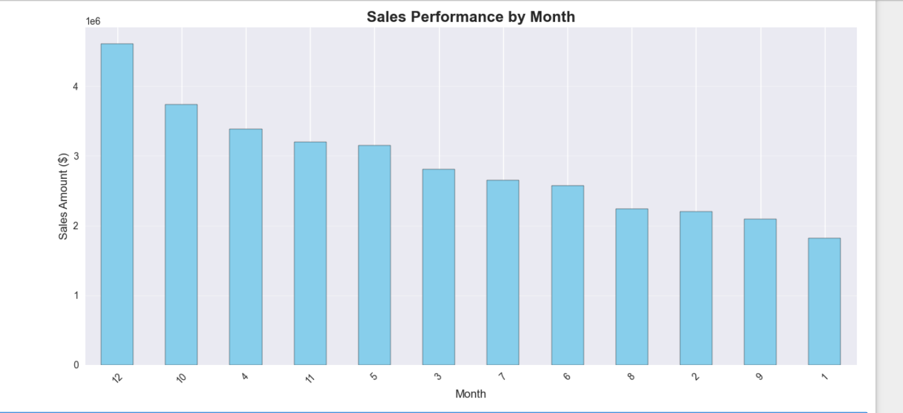
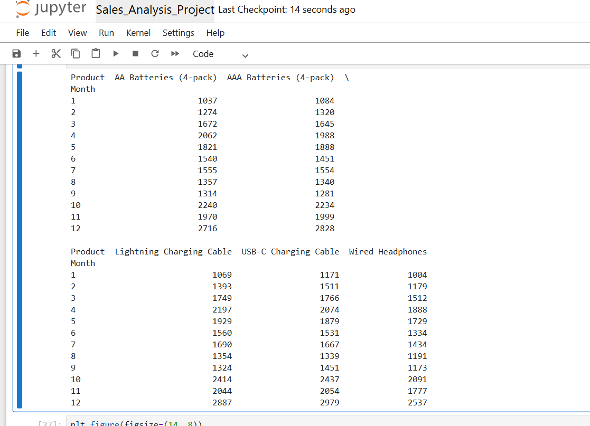
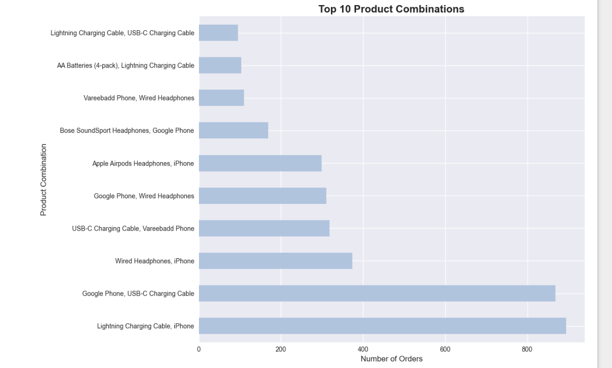

# Sales Performance Analysis & Business Intelligence

**Company:** Electronics Retail Store  
**Problem:** Declining sales performance and lack of data-driven insights

## Project Overview

This analysis examines 186,850+ sales transactions to identify performance patterns and optimize retail operations. The project provides actionable insights for inventory management, pricing strategies, and geographic expansion.

## Key Insights

- December is the peak sales month with highest revenue
- New York, Los Angeles, and San Francisco are top-performing cities
- AAA Batteries is the best-selling product with highest quantity
- Price-quantity correlation exists for strategic pricing decisions
- iPhone + Charging Cable is the most common product combination
- Clear seasonal trends show Q4 performance boost

## Business Objectives

**Purpose:** Unlock hidden sales insights for retail operations team to support data-driven decision making and reduce manual data gathering time.

**Stakeholders:** Sales Director, Marketing Team, Inventory Management Team, Data Analytics Team

**Success Criteria:**
- Provide actionable insights for 15% revenue increase through optimized inventory and pricing
- Reduce manual data gathering time by 25% for sales analysts
- Enable data-driven decision making with latest sales performance insights

## Dataset

- **Size:** 186,850+ sales transactions
- **Period:** Multi-month sales data
- **Fields:** Order ID, Product, Quantity, Price, Order Date, Purchase Address

## Analysis Results

### Monthly Sales Performance
Shows December as the peak sales month with highest revenue, demonstrating clear seasonal trends and Q4 performance optimization opportunities.

### Product Performance Analysis
Dual-axis chart revealing AAA Batteries as the best-selling product and demonstrating price-quantity correlation for strategic pricing decisions.

### Market Basket Analysis
Horizontal bar chart showing iPhone + Charging Cable as the most common product combination, enabling cross-selling strategies.

## Technical Implementation

**Technologies:** Python, Pandas, NumPy, Matplotlib, Seaborn, PyArrow

**Methods:** Data cleaning, feature engineering, statistical analysis, time series analysis, market basket analysis, geographic analysis, data visualization

## Business Impact

- Analyzed 186K+ transactions for data-driven decisions
- Identified seasonal opportunities for revenue optimization
- Provided geographic and product insights for strategic planning
- Delivered inventory and pricing optimization recommendations

## Recommendations

- Increase inventory and marketing budget for December
- Focus expansion efforts in New York, Los Angeles, San Francisco
- Implement dynamic pricing for high-volume, low-price items
- Bundle iPhone with Charging Cable for cross-selling
- Pre-stock inventory for October-November-December period

